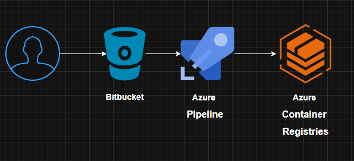

# 🚀 Azure Pipelines – Docker Build & Push
## English
Collection of **Azure DevOps** pipelines to build Docker images and push them to **Azure Container Registry (ACR)** or **Amazon Elastic Container Registry (ECR)**, with optional metadata and vulnerability scanning via Trivy.

### Table of contents
- [Included pipelines](#included-pipelines)
- [Prerequisites](#prerequisites)
- [Configuration](#configuration)
- [Usage](#usage)
- [Repository structure](#repository-structure)

### Included pipelines
| Pipeline | Registry | Description |
|----------|----------|-------------|
| **ACR (basic)** | Azure Container Registry | Build and push Docker image to ACR. |
| **ACR (complete)** | Azure Container Registry | Build, push, and metadata (commit, author, version from `package.json`). |
| **ECR (basic)** | Amazon ECR | Build and push Docker image to ECR. |
| **ECR (complete)** | Amazon ECR | Build, push, and metadata. |
| **Scanning** | Amazon ECR | Build, **Trivy** scan (CRITICAL/HIGH/MEDIUM/LOW), push only if no vulnerabilities. |

### Prerequisites
- **Azure DevOps** project.
- **Dockerfile** in the repo root (or path specified in the pipeline).
- For ACR: **Service Connection** (Azure Resource Manager) in the project.
- For ECR: AWS credentials (Access Key ID and Secret Access Key) or AWS Service Connection.

### Configuration
**Azure Container Registry (ACR)**

1. **Project Settings** → **Service connections** → **New** → **Azure Resource Manager**.
2. Configure the connection and name it `AzureSubscription` (or update the YAML).
3. Pipeline variables:
   - `DOCKER_REPOSITORY_NAME`: ACR name **without** `.azurecr.io` (e.g. `myregistry`).
   - `DOCKER_IMAGE`: image name (e.g. `my-app`).

**Amazon ECR (ECR)**

Pipeline variables (mark credentials as **secret**):

- `AWS_ACCOUNTID` – AWS account ID.
- `AWS_REGION` – Region (e.g. `us-east-1`).
- `AWS_ACCESS_KEY_ID` – Access Key (secret).
- `AWS_SECRET_ACCESS_KEY` – Secret Access Key (secret).
- `DOCKER_REPOSITORYNAME` – ECR repository name.

**Scanning (Trivy)**

Same variables as ECR. Trivy is installed on the agent; version is fetched dynamically from GitHub.

### Usage
1. Copy the pipeline YAML you need into your repo (or use the path in this repo).
2. In Azure DevOps: **Pipelines** → **New pipeline** → choose repo → select the `.yml` file.
3. Set variables and Service Connection as above.
4. Run the pipeline (manually or via trigger).

Pipelines are set to trigger on the `main` branch; you can change the `trigger` in each file.

### Repository structure
```
AzurePipelines/
├── README.md
├── acr.png
├── ecr.png
├── azure-container-registries/
│   ├── azure-pipelines-acr.yml           # ACR basic
│   └── azure-pipelines-complete-acr.yml  # ACR + metadata
├── elastic-container-registry/
│   ├── azure-pipelines-basic-erc.yml     # ECR basic
│   └── azure-pipelines-complete-ecr.yml  # ECR + metadata
└── scaning-docker/
    ├── azure-pipelines.yml               # Build + Trivy + push to ECR
    └── README.md
```

### Diagrams
**Pipeline with Azure Container Registry (ACR)**



**Pipeline with Amazon Elastic Container Registry (ECR)**


### Quick summary
- **ACR**: build + push to Azure; “complete” adds metadata (commit, author, version).
- **ECR**: build + push to AWS; “complete” adds metadata.
- **Scanning**: build → Trivy (CRITICAL/HIGH/MEDIUM/LOW) → push to ECR only if scan passes.

For more detail on design, variables, and practices, see `REVIEW_MEJORAS.md` and `CHANGELOG_MEJORAS.md` in the repo (if present).
---
## Español
Colección de pipelines de **Azure DevOps** para construir imágenes Docker y publicarlas en **Azure Container Registry (ACR)** o **Amazon Elastic Container Registry (ECR)**, con opciones de metadata y escaneo de vulnerabilidades con Trivy.

### Tabla de contenidos
- [Pipelines incluidos](#pipelines-incluidos)
- [Requisitos previos](#requisitos-previos)
- [Configuración](#configuración-1)
- [Uso](#uso)
- [Estructura del repositorio](#estructura-del-repositorio)

### Pipelines incluidos
| Pipeline | Registro | Descripción |
|----------|----------|-------------|
| **ACR (básico)** | Azure Container Registry | Build y push de imagen Docker a ACR. |
| **ACR (completo)** | Azure Container Registry | Build, push y generación de metadata (commit, autor, versión desde `package.json`). |
| **ECR (básico)** | Amazon ECR | Build y push de imagen Docker a ECR. |
| **ECR (completo)** | Amazon ECR | Build, push y generación de metadata. |
| **Scanning** | Amazon ECR | Build, escaneo con **Trivy** (CRITICAL/HIGH/MEDIUM/LOW) y push solo si no hay vulnerabilidades. |

### Requisitos previos
- **Azure DevOps** con un proyecto configurado.
- **Dockerfile** en la raíz del repo (o ruta indicada en el pipeline).
- Para ACR: **Service Connection** de tipo *Azure Resource Manager* en el proyecto.
- Para ECR: credenciales AWS (Access Key ID y Secret Access Key) o Service Connection de AWS.

### Configuración
**Azure Container Registry (ACR)**

1. En el proyecto: **Project Settings** → **Service connections** → **New service connection** → **Azure Resource Manager**.
2. Configura la conexión con tu suscripción de Azure y nómbrala `AzureSubscription` (o ajusta el nombre en el YAML).
3. Variables de pipeline:
   - `DOCKER_REPOSITORY_NAME`: nombre del ACR **sin** `.azurecr.io` (ej: `miregistry`).
   - `DOCKER_IMAGE`: nombre de la imagen (ej: `mi-app`).

**Amazon ECR (ECR)**

Variables de pipeline (marcar como **secretas** las credenciales):

- `AWS_ACCOUNTID` – ID de la cuenta AWS.
- `AWS_REGION` – Región (ej: `us-east-1`).
- `AWS_ACCESS_KEY_ID` – Access Key (secreto).
- `AWS_SECRET_ACCESS_KEY` – Secret Access Key (secreto).
- `DOCKER_REPOSITORYNAME` – Nombre del repositorio en ECR.

**Pipeline de scanning (Trivy)**

Usa las mismas variables que los pipelines de ECR. Trivy se instala en el agente; la versión se obtiene dinámicamente desde GitHub.

### Uso
1. Copia el YAML del pipeline que necesites a tu repositorio (o usa la ruta existente en este repo).
2. Crea un **nuevo pipeline** en Azure DevOps: *Pipelines* → *New pipeline* → *Azure Repos Git* (o GitHub, etc.) → selecciona el `.yml` correspondiente.
3. Configura las variables y la Service Connection según la tabla anterior.
4. Ejecuta el pipeline (manual o con el trigger definido en el YAML).

Los pipelines están configurados para dispararse en la rama `main`; puedes cambiar el `trigger` en cada archivo.

### Estructura del repositorio
```
AzurePipelines/
├── README.md
├── acr.png
├── ecr.png
├── azure-container-registries/
│   ├── azure-pipelines-acr.yml           # ACR básico
│   └── azure-pipelines-complete-acr.yml  # ACR + metadata
├── elastic-container-registry/
│   ├── azure-pipelines-basic-erc.yml     # ECR básico
│   └── azure-pipelines-complete-ecr.yml  # ECR + metadata
└── scaning-docker/
    ├── azure-pipelines.yml               # Build + Trivy + push a ECR
    └── README.md
```

### Diagramas

**Pipeline con Azure Container Registry (ACR)**


**Pipeline con Amazon Elastic Container Registry (ECR)**


### Resumen rápido

- **ACR**: build + push a Azure; versión “completa” con metadata (commit, autor, versión).
- **ECR**: build + push a AWS; versión “completa” con metadata.
- **Scanning**: build → Trivy (CRITICAL/HIGH/MEDIUM/LOW) → push a ECR solo si el escaneo pasa.
