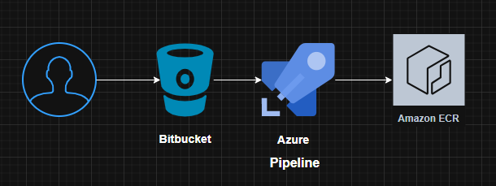

# AzurePipelines
This repository contains multiple Azure Pipelines, including basic pipelines that build Docker images and push them to Azure Container Registry, and others that build and push Docker images to AWS ECR. Additionally, there are pipelines with Bash commands to retrieve information such as commit ID, merge author, branch name, and other pipeline details, facilitating automation and monitoring.

## Azure pipelines with Elastic Container Registry

